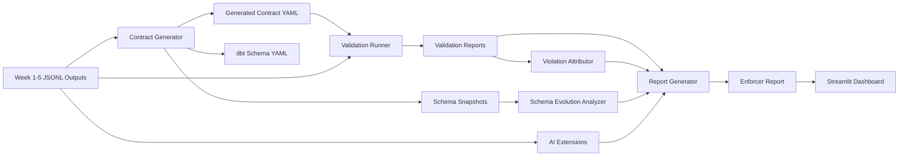
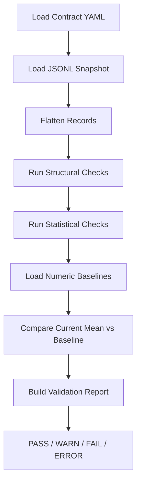
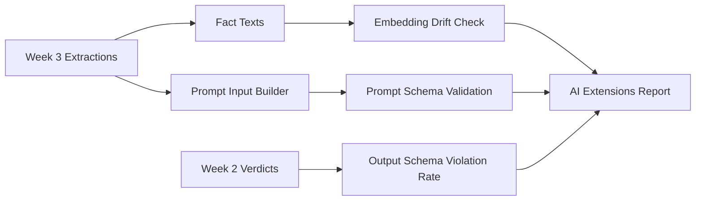

# How I Built a Data Contract Enforcer for Reliable Data and AI Pipelines

Modern data systems rarely fail in dramatic ways. More often, they fail quietly.

A job still runs. A dashboard still refreshes. An AI workflow still returns output. But somewhere upstream, a field changed scale, a timestamp became invalid, or a model-facing input drifted just enough to make the downstream result unreliable.

That is the problem I wanted to solve with **Data Contract Enforcer**: a project that turns data assumptions into machine-checkable contracts, validates new snapshots against those contracts, traces failures through lineage, adds AI-specific checks, and generates a final report for humans.

In this post, I’ll walk through the architecture, the workflow, and the real project results.

## The Problem

In a multi-stage pipeline, every system depends on assumptions made by another system:

- a confidence score is expected to stay between `0.0` and `1.0`
- a document id is expected to be present and valid
- an enum is expected to stay within an allowed set
- prompt inputs are expected to follow a schema
- LLM outputs are expected to remain structurally valid

When those assumptions are not explicitly enforced, breakages spread silently.

## The Goal

The goal of this project was to build a practical enforcement layer that can:

- infer a contract from real JSONL data
- validate clean and broken snapshots against that contract
- establish statistical baselines for drift detection
- attribute failures to likely upstream sources
- analyze schema evolution across snapshots
- evaluate AI-specific risks such as prompt-input validity and embedding drift
- summarize everything in a single health report and dashboard

## System Architecture

At a high level, the project works like this:



The project is built around a few core components:

- `contracts/generator.py`
- `contracts/runner.py`
- `contracts/attributor.py`
- `contracts/schema_analyzer.py`
- `contracts/ai_extensions.py`
- `contracts/report_generator.py`
- `app.py`

## Step 1: Generate a Contract from Real Data

The first part of the system reads structured JSONL data and converts it into a contract.

For my Week 3 extraction dataset, the generator:

- loaded `outputs/week3/extractions.jsonl`
- flattened nested facts and entities
- profiled columns
- inferred column types and required fields
- derived numeric ranges
- created a Bitol-style contract
- created a dbt-compatible schema file
- wrote a timestamped snapshot for later comparison

One of the most important rules it created was this:

```yaml
fact_confidence:
  type: number
  required: true
  minimum: 0.0
  maximum: 1.0
  description: Confidence score. Must remain 0.0-1.0 float. BREAKING if changed to 0-100 integer scale.
```

That clause matters because it captures a real business expectation. A confidence score should remain normalized between `0` and `1`. If it suddenly changes to a `0-100` scale, downstream logic may still run, but the meaning is broken.

## Step 2: Validate Clean Data and Establish a Baseline

Once the contract exists, the next step is validation.

The runner checks each clause and produces a structured report with:

- `report_id`
- `contract_id`
- `snapshot_id`
- `run_timestamp`
- `total_checks`
- `passed`
- `failed`
- `warned`
- `errored`
- `results[]`

On the clean Week 3 dataset, the result was:

- **30 total checks**
- **30 passed**
- **0 failed**
- **0 errored**

The runner also established numeric baselines for drift detection. For example:

- `fact_confidence.mean = 0.8637`
- `fact_confidence.stddev = 0.07555`
- `processing_time_ms.mean = 1577.9167`

This baseline gives the system a definition of “normal behavior,” not just “valid structure.”

## Step 3: Inject a Realistic Breaking Change

To prove the system works, I introduced an intentional failure.

The script `create_violation.py` transforms confidence values from `0.0-1.0` into `0-100`.

So a valid value like:

```text
0.92
```

becomes:

```text
92.0
```

This is a perfect demo scenario because it is realistic. It is the kind of upstream change that can silently break downstream systems without causing an obvious crash.

## Step 4: Catch the Breakage

When I ran validation against the violated dataset, the system caught two important failures:

1. `fact_confidence.range`
2. `fact_confidence.drift`

The broken run produced:

- **30 total checks**
- **28 passed**
- **2 failed**

And the key failure values were:

- `max = 99.0000`
- expected `max <= 1.0`
- `mean = 86.3667`
- `z = 1131.74`
- `records_failing = 720`

That means the system did not just notice a range violation. It also detected that the statistical behavior of the field had moved massively away from its baseline.

This is the difference between simple schema validation and actual data reliability engineering.

## Validation Flow

The validation logic can be summarized like this:



## Step 5: Attribute the Failure

Detection is useful, but in real systems the next question is always:

**Where did this failure come from, and who else is affected?**

That is where the violation attributor comes in.

It reads:

- the validation report
- the lineage snapshot
- the contract
- the subscription registry

Then it builds a violation record with:

- `violation_id`
- `check_id`
- `detected_at`
- `blame_chain[]`
- `blast_radius`

For my failed run, the attribution output showed:

- **2 violation records**
- **4 blast radius nodes**

The affected nodes included:

- `pipeline::week3-extraction-output`
- `file::src/week4/cartographer.py`
- `pipeline::week5-event-pipeline`
- `service::validation-runner`

This turns a simple validation error into an investigation path.

## Step 6: Add Schema Evolution Analysis

Another important question is whether the contract itself changed over time.

The schema evolution analyzer compares consecutive snapshots and classifies changes as:

- breaking
- compatible

It also supports:

- rollback plans
- migration impact reports
- explicit handling of narrow-type and range changes
- a `--since` filter for selective analysis

In my current data, the compared snapshots showed:

- **0 total changes**
- **0 breaking**
- **0 compatible**

That might seem surprising, but it is an important concept:

> data values can break the contract even when the contract snapshot itself has not changed.

## Step 7: Extend Contracts into AI Reliability

Traditional data contracts are not enough for AI systems, so I added three AI-specific extensions:

1. embedding drift detection
2. prompt input schema validation
3. LLM output schema violation rate tracking

The current AI results were:

- **Embedding Drift = 1.0128** → `FAIL`
- **Prompt Quarantined = 0** → `PASS`
- **Output Violation Rate = 0.0** → `PASS`

That means:

- prompt inputs were healthy
- LLM outputs were structurally healthy
- but semantic drift was flagged as high

This is important because AI systems can degrade even when the normal tabular schema still looks valid.

## AI Extension Flow



## Step 8: Summarize Everything in a Final Report

The last stage is the report generator.

It reads from:

- `validation_reports/`
- `violation_log/`
- `schema_evolution.json`
- `ai_extensions.json`

Then it produces a final report with:

- Data Health Score
- Health Narrative
- Violation Count
- Top Violations
- Schema Changes
- AI Risk Assessment
- Recommendations

My current report shows:

- **Health Score = 78**
- **Violation Count = 2**
- **Recommendations = 3**

Top violation:

> The `fact_confidence` field failed its range check. Expected `max<=1.0`, but found `max=99.0000`, affecting `720` records.

That final summary is also rendered in the Streamlit dashboard, which makes the whole project easier to demo and explain.

## What I Learned

A few things became very clear while building this:

- Silent data failures are more dangerous than obvious crashes.
- A contract is not just a schema; it is an operational promise.
- Baselines matter because “valid” does not always mean “normal.”
- Attribution and blast radius are what make validation actionable.
- AI systems need extra reliability checks beyond normal data validation.

The most valuable part of the project is not just that it catches bad data. It explains:

- what broke
- how severe it is
- where it likely came from
- what downstream systems may be affected
- what to do next

## Final Thoughts

Data Contract Enforcer started as a rubric-driven engineering project, but it became something more useful: a practical example of how to bring reliability thinking into both data pipelines and AI workflows.

Instead of waiting for downstream damage to reveal a problem, this system catches issues at the contract boundary, records them in a structured way, and translates them into a report that both engineers and stakeholders can understand.

That shift, from silent breakage to explicit enforcement, is the real value of the project.

---

Built by **abduvaio**  
Let’s connect and make the project better.
